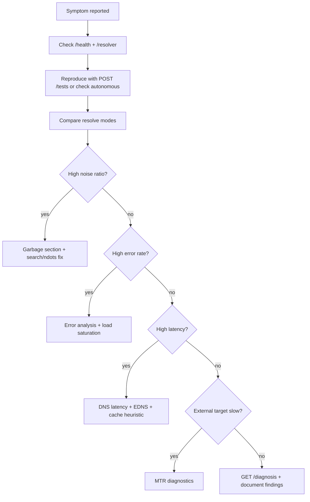

# DNS Debug Skill

Use this skill when working on DNS resolution logic, load-test execution, ndots/search analytics, Prometheus metrics, MTR diagnostics, optional Web UI, or AI documentation for the dns-dig project.

## When to use

- Debugging search domain or ndots-related latency
- Adding or changing noise classification
- Extending diagnosis signals or summary fields
- Adding or documenting Prometheus metrics
- Implementing or extending the optional Web UI observability layer
- Reviewing changes that touch `dns_runner`, `stats_store`, `ndots_analytics`, `mtr_runner`, `app/ui/`, or `app/security/`
- Interpreting UI dashboards together with Prometheus and API responses

## Project context

FastAPI DNS debug service inside a Docker container. Uses embedded DNS `127.0.0.11` via standard bridge networking. Reads `/etc/resolv.conf` but never modifies it. Optional MTR measures TCP path; optional Web UI visualizes DNS and MTR for engineers, SREs, QA, and analysts.

**Hard constraints:** no resolv.conf changes, no `dns:`/`dns_search:` in compose, no host network, no sidecar DNS, no fake cache claims.

## Sibling references

- [debugging-checklist.md](debugging-checklist.md) — step-by-step operational flow with curl examples and UI walkthrough
- [metrics-reference.md](metrics-reference.md) — exact Prometheus metric names, conceptual mapping, UI panel mapping

## Resolution modes

| Label | Source | Notes |
|-------|--------|-------|
| `system` | `resolve_modes` | Application-like resolver with search |
| `absolute_fqdn` | `resolve_modes` | Trailing dot, no search |
| `ndots:N` | `ndots_values` | Programmatic ndots override per value N |

Search probes (`_run_search_probes`) are **diagnostic** — they measure search suffix overhead and are not primary app queries.

## How to analyze DNS

1. **Start with resolver snapshot** — `GET /resolver`: nameservers, search list, ndots, timeout, attempts, options.
2. **Compare resolve modes** — `system` vs `absolute_fqdn` query counts and latency (`dns_debug_fqdn_latency_delta_ms`, UI DNS latency section).
3. **Check amplification** — `dns_debug_query_amplification_ratio` > 2 suggests search/ndots overhead.
4. **Read diagnosis** — `GET /tests/{id}/diagnosis` for automated signals and recommendations.
5. **Per-record drilldown** — UI Records section or `GET /tests/{id}` counters by record.

**Hypotheses to test:**

| Hypothesis | Evidence | Confirm with |
|------------|----------|--------------|
| Search domains cause extra lookups | High noisy ratio, `search_suffix_*` counts | Compare `absolute_fqdn` query total |
| ndots threshold too low | `ndots:4` worse than `ndots:5` | Run test with multiple ndots values |
| Specific record broken | High errors for one FQDN | Record drilldown + error by domain |
| Resolver upstream slow | High latency across all records | MTR + per-resolver latency |

## How to analyze EDNS

1. Read `/resolver` `options` for `edns0` presence.
2. Check UI **EDNS analytics** section: per-level (edns0–edns5) queries, errors, avg latency, error rate.
3. Correlate EDNS error spikes with `dns_debug_queries_total{outcome="error"}` by time window.
4. If one EDNS level shows high error rate, suspect resolver/upstream EDNS incompatibility — not application code.

**Anti-pattern:** Treating EDNS analytics as optional — they are mandatory in the observability model.

## How to analyze garbage / noisy queries

Six `NoiseType` values — always separate from useful primary lookups:

| Type | Meaning |
|------|---------|
| `search_suffix_query` | Diagnostic probe to search domain |
| `search_suffix_nxdomain` | Search suffix returned NXDOMAIN |
| `duplicate_query` | Same key within 2 s window |
| `empty_answer` | SUCCESS with zero answers |
| `aaaa_noise` | Redundant AAAA after A succeeded |
| `eventual_fqdn_success` | Search failed, absolute_fqdn succeeded |

Check `dns_debug_noisy_queries_total`, UI **Garbage** section, `summary.noisy_query_ratio`. High `search_suffix_*` → fix short names or search list at orchestration level, not in this service.

## How to analyze cache behavior

- Metrics: `dns_debug_possible_cached_response_total`, `dns_debug_repeat_query_latency_delta_ms`.
- UI **Cache behavior** section — always with heuristic disclaimer.
- **Never** interpret rising cache counters as confirmed Docker DNS cache hits.
- Useful signal: repeat queries significantly faster than first — may indicate caching or warm resolver path.
- Cross-check: cache KPI vs latency line chart — if latency flat, cache heuristic is weak evidence.

## How to analyze MTR

1. `GET /health` — `mtr_enabled`, `mtr_service_name`.
2. `GET /mtr` — latest hop table, loss %, latency stats.
3. UI **MTR diagnostics** — verdict card, problem hops, timeline.
4. Metrics: `dns_debug_mtr_runs_total`, `dns_debug_mtr_last_exit_code`.

**Verdict interpretation:**

| Verdict | Meaning |
|---------|---------|
| `local_issue` | Loss/latency at early hops (container/network edge) |
| `upstream_issue` | Mid-path degradation |
| `destination_issue` | Loss/latency at final hops |
| `unstable_path` | High stdev, intermittent spikes |
| `packet_loss_suspected` | Sustained loss on one or more hops |

MTR diagnoses **TCP path**, not DNS resolver configuration. Do not conflate MTR failures with DNS query errors.

## How to analyze Web UI and Prometheus together

**Artifacts to check first (in order):**

1. `GET /health` — service up, autonomous/MTR flags
2. `GET /resolver` — baseline DNS config
3. `GET /summary` or UI **Overview** — aggregate health
4. `GET /metrics` — rate-based signals for alerting
5. UI sections matching the symptom (latency, errors, garbage, MTR)
6. `GET /tests/{id}/diagnosis` — automated recommendations

**Correlation pattern:**

```
Prometheus alert (error rate) → UI Error analysis heatmap → Record drilldown for top domain → /diagnosis recommendations
```

UI polls JSON API every `DNS_DEBUG_UI_REFRESH_SECONDS`; Prometheus scrapes `/metrics` independently. Use UI for exploration, Prometheus for alerting and SLOs.

## Troubleshooting flow



## Anti-patterns

- Replacing `127.0.0.11` with public DNS to "fix" tests
- Modifying resolv.conf instead of using `absolute_fqdn` or ndots overrides
- Counting search probes as application traffic
- Presenting cache heuristic as real cache hit rate in UI or docs
- Removing EDNS or per-resolver breakdown to simplify UI
- Making UI required for test execution
- Adding React/Vue build pipeline without explicit request
- Mixing MTR path issues with DNS resolver misconfiguration in root-cause writeups
- Renaming `dns_debug_*` metrics without updating `metrics-reference.md`

## Extension points

### `app/dns_runner.py`

| Function | Purpose |
|----------|---------|
| `expand_work_items` | Cartesian product of records, query types, resolve specs |
| `_resolve` | Single DNS query via dnspython; handles ndots override, search flag, probe mode |
| `_classify_noise` | Maps attempt to `NoiseType` (6 types) |
| `_run_search_probes` | Diagnostic search suffix queries per search domain |
| `_check_cache` | Heuristic repeat-query latency comparison |
| `_execute_query` | Primary query + optional search probes |

### `app/stats_store.py`

| Function | Purpose |
|----------|---------|
| `record_attempt` | Persist `QueryAttempt`, update per-record and per-mode counters |
| `build_summary` | Aggregate `TestSummaryResponse` including noise counts and ndots analytics hook |

### `app/ndots_analytics.py`

| Function | Purpose |
|----------|---------|
| `build_test_analytics` | Compute `NdotsSearchAnalytics` from test state and resolver snapshot |
| `build_diagnosis` | Produce `DiagnosisResponse` with signals, severity, recommendations |

### `app/mtr_runner.py`

| Function | Purpose |
|----------|---------|
| `build_mtr_command` | argv for `mtr -rzbw HOST --tcp -P PORT -c N` (no shell) |
| `run_mtr` | Subprocess exec, parse report, update store and metrics |
| `parse_mtr_report` | Line-parser for tabular `-r` hop output |
| `start_mtr_background` / `cancel_mtr` | Periodic runner lifecycle |
| `trigger_mtr_now` | On-demand run via API (mutex via `asyncio.Lock`) |

### `app/mtr_store.py`

| Function | Purpose |
|----------|---------|
| `create_run` / `finalize_run` | Track running and completed MTR results |
| `get_latest` / `list_runs` | API read paths |

### `app/metrics.py`

| Function | Purpose |
|----------|---------|
| `record_query` | Increment `dns_debug_queries_total`, observe `dns_debug_query_latency_seconds` |
| `record_noisy` | Increment `dns_debug_noisy_queries_total` |
| `record_possible_cache` | Increment `dns_debug_possible_cached_response_total`, observe delta histogram |
| `set_test_analytics` | Set amplification, search NXDOMAIN ratio, FQDN latency deltas |
| `init_from_snapshot` | Set startup gauges from resolver snapshot |
| `set_test_progress` | Update per-test progress gauge |
| `record_mtr_run` | Update MTR gauges and counter |

### `app/security/`

| Module | Purpose |
|--------|---------|
| `principal.py` | `Role`, `Principal` types |
| `auth.py` | Bearer/API-key auth, FastAPI dependencies (`RequireReadOnly`, `RequireOperator`) |
| `classification.py` | Endpoint → protection class mapping |
| `middleware.py` | Auth gate, body size limit |
| `rate_limit.py` | Per-IP/token rate limiting |
| `ip_allowlist.py` | CIDR allowlist checks |
| `audit.py` | Structured security audit logging |
| `abuse.py` | Concurrent DNS run limits |

### `app/ui/` (optional, `DNS_DEBUG_UI_ENABLED`)

| Component | Purpose |
|-----------|---------|
| `ui_aggregator` | Build overview, latency, EDNS, errors, garbage, cache, records, load, MTR, rankings from stores + metrics |
| `ui_router` | Mount `{BASE_PATH}/`, static assets, `GET /api/ui/*` JSON endpoints |
| `templates/dashboard.html` | Jinja2 shell: KPI cards, 10 sections, filters, theme toggle |
| `static/` | CSS, vanilla JS, Chart.js — poll every `DNS_DEBUG_UI_REFRESH_SECONDS` |

UI env vars: `DNS_DEBUG_UI_ENABLED`, `DNS_DEBUG_UI_AUTH_ENABLED`, `DNS_DEBUG_UI_READONLY`, `DNS_DEBUG_UI_BASE_PATH`, `DNS_DEBUG_UI_REFRESH_SECONDS`.

## UI optional / readonly rules

- Core must run with `DNS_DEBUG_UI_ENABLED=false` — no UI imports breaking startup.
- Default `DNS_DEBUG_UI_READONLY=true` — no POST/DELETE from browser; control tests via core API.
- `DNS_DEBUG_UI_AUTH_ENABLED=true` when UI enabled in production.
- New env vars for UI must be documented in `AGENT.md`, this skill, and `.cursor/rules/dns-debug-project.mdc`.

## Change checklist

Before merging DNS-, MTR-, UI-, or security-related changes:

1. **Constraints** — no resolv.conf edits, no compose DNS overrides, no host network, no sidecar
2. **Metric names** — match `metrics-reference.md` exactly; no separate errors counter
3. **Resolve labels** — use `system`, `absolute_fqdn`, `ndots:N` consistently
4. **Search probes** — keep `is_search_probe` separate from primary queries; exclude probes from cache heuristic
5. **Cache honesty** — document heuristic nature; never imply Docker internal cache access
6. **API stability** — core paths unchanged unless explicitly requested
7. **Noise types** — align with `models.NoiseType` enum values
8. **UI optional** — core must run with `DNS_DEBUG_UI_ENABLED=false`
9. **UI readonly** — respect `DNS_DEBUG_UI_READONLY=true`; no mutating browser actions by default
10. **No heavy SPA** — prefer Jinja2 + vanilla JS + Chart.js
11. **Security** — classify new endpoints; write/expensive need operator+; no secret logging
12. **Security docs sync** — auth/roles/limits changes update `docs/SECURITY.md`, `AGENT.md`, rules
13. **Docs** — update `AGENT.md`, this skill, `metrics-reference.md`, or `debugging-checklist.md` if behavior changes

## Safe modifications

- New diagnosis thresholds via `config.py` env vars
- Additional noise types (enum + metrics label + classification logic)
- New summary, diagnosis, or UI JSON fields derived from existing attempt data
- New dashboard sections fed by existing aggregators
- Histogram bucket tuning (preserve metric names)

## Risky modifications

- Changing how `absolute_fqdn` appends trailing dot
- Altering search probe triggering conditions without updating analytics
- Renaming `outcome` label values on `dns_debug_queries_total`
- Infrastructure changes that bypass `127.0.0.11`
- Bundling React/Vue or breaking core API when UI is disabled
- Presenting UI cache cards as confirmed Docker DNS cache hits
