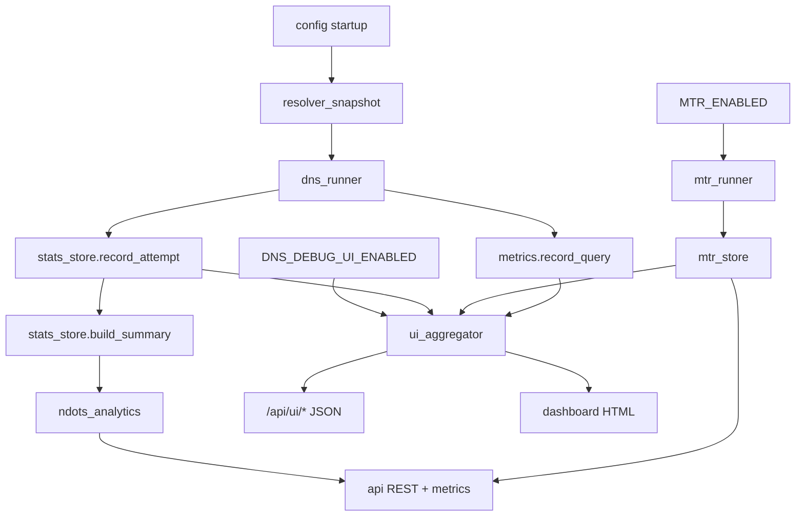

# DNS Debug — Agent Engineering Brief

## Project purpose

DNS Debug is a **FastAPI service** that runs inside a **Docker container** and diagnoses DNS behavior through the standard embedded Docker resolver (`127.0.0.11`). It does not modify the host or replace the resolver.

The service helps operators, SREs, QA engineers, and analysts understand:

- Extra queries generated by search domains and `ndots` thresholds
- Error, NXDOMAIN, and timeout rates under load
- Latency differences between `system` resolution and `absolute_fqdn` (trailing dot)
- Noisy query patterns (search suffix probes, duplicates, dual-stack AAAA)
- Heuristic cache-like latency signals (not real Docker DNS cache introspection)
- TCP path quality via optional MTR diagnostics
- Visual DNS and MTR state via an **optional** built-in Web UI observability layer

Primary use cases: load-test DNS from inside the container network, compare resolve modes, surface ndots/search misconfiguration signals, and visually analyze results when the UI is enabled.

## Mandatory invariants

1. **DNS engine works without UI** — core tests, metrics, and API must function with `DNS_DEBUG_UI_ENABLED=false`.
2. **UI is not a required dependency** for tests or background execution.
3. **UI is enabled only via env var** — no implicit UI startup.
4. **Prometheus metrics are mandatory** — `/metrics` is always part of the core surface.
5. **EDNS analytics are mandatory** — documented and exposed in metrics/UI aggregators.
6. **Garbage query accounting is mandatory** — six `NoiseType` values tracked separately from primary lookups.
7. **Cache visibility is mandatory** — as a **heuristic**, never as real cache introspection.
8. **Per-resolver breakdown is mandatory** — by `resolve_mode` and nameserver path.
9. **MTR observability is mandatory in documentation** — optional at runtime via `MTR_ENABLED`.
10. **Background mode is mandatory** — tests run as asyncio background tasks.
11. **Visual degradation detection** — when UI is enabled, a developer must open one page and quickly spot DNS/MTR degradation.

## Hard constraints (non-negotiable)

These invariants must hold across code, docs, and infrastructure changes:

1. **No `/etc/resolv.conf` modifications** — read-only snapshot via `resolver_snapshot.py`; `ndots` overrides are programmatic (dnspython) only.
2. **No `dns:` or `dns_search:` in `docker-compose.yml`** — use default Docker bridge embedded DNS.
3. **No `network_mode: host`** — container must stay on bridge networking.
4. **No sidecar DNS** — no unbound, bind, dnsmasq, or custom resolver containers.
5. **No fake cache claims** — `dns_debug_possible_cached_response_total` and related fields are **heuristics** (repeat-query latency delta), not proof of Docker DNS cache hits.
6. **Stable public API and metric names** — do not rename core endpoints or Prometheus metrics without explicit approval.

## Core architecture

| Module | Responsibility |
|--------|----------------|
| `app/config.py` | Settings from environment (autonomous mode, MTR, UI, diagnosis thresholds) |
| `app/resolver_snapshot.py` | Parse and cache `/etc/resolv.conf` (nameservers, search, ndots, timeout, attempts, options) |
| `app/dns_runner.py` | Background test execution, query resolution, search probes, noise classification |
| `app/stats_store.py` | Per-test state, attempt recording, summary aggregation |
| `app/ndots_analytics.py` | ndots/search analytics and automated diagnosis |
| `app/mtr_runner.py` | Periodic and on-demand MTR (TCP) subprocess runs |
| `app/mtr_store.py` | In-memory MTR run history |
| `app/api.py` | FastAPI core routes + UI JSON endpoints (when UI enabled) |
| `app/metrics.py` | Prometheus counters, gauges, histograms |
| `app/ui/` (optional) | Jinja2 templates, static assets, UI router, data aggregators for dashboard |

### Data flow

## Background execution

Tests are started via `POST /tests` (manual) or `AUTONOMOUS_MODE=true` (continuous background runner). Each test:

1. Expands work items: `records × resolve_modes × ndots_values × query_types` via `expand_work_items`.
2. Spawns an asyncio background task that rate-limits queries at configured RPS with bounded concurrency.
3. Records each `QueryAttempt` in `stats_store` and increments Prometheus metrics via `metrics.record_query`.
4. Classifies noise via `_classify_noise` and runs search probes (`_run_search_probes`) for diagnostic modes only.
5. Applies cache heuristic (`_check_cache`) on repeat keys — excluded for search probes.
6. Updates per-test progress gauge until duration elapses or test is cancelled.

The core engine never blocks the HTTP handler on query completion. UI and Prometheus observe in-progress state through `stats_store` and gauges like `dns_debug_active_tests`.

## Embedded Docker DNS and container cache semantics

- **Resolver path**: Applications in the container use `127.0.0.11` (embedded DNS). The service reads `/etc/resolv.conf` to discover nameservers, search domains, `ndots`, timeout, and options — but never writes to it.
- **Search domains**: Docker injects search suffixes (e.g. `svc.cluster.local`). Short names trigger multiple lookups before FQDN resolution — this is the primary source of query amplification.
- **ndots**: Controls when the resolver tries search domains vs treating a name as FQDN. Programmatic `ndots:N` overrides in dnspython compare threshold scenarios without changing resolv.conf.
- **Cache semantics**: Docker embedded DNS maintains an internal cache opaque to this service. `dns_debug_possible_cached_response_total` detects **faster repeat queries** (latency delta heuristic) — treat as a weak signal only. UI cache cards must display a disclaimer.
- **No host loopback substitution**: Do not replace `127.0.0.11` with `8.8.8.8` or host DNS — that breaks container-network fidelity.

## Resolution model

| Mode | Label | Behavior |
|------|-------|----------|
| System | `system` | dnspython with `search=True` — mimics application resolver behavior |
| Absolute FQDN | `absolute_fqdn` | Name with trailing dot, `search=False` — bypasses search domains |
| ndots override | `ndots:N` | Programmatic `resolver.ndots = N` with search enabled — compares threshold scenarios |

`ndots:N` modes are added via `ndots_values` in API requests or `AUTONOMOUS_NDOTS_VALUES` / `DEFAULT_NDOTS_VALUES` in `.env`.

### Search probes (diagnostic only)

For `system` and `ndots:*` modes, `_run_search_probes` issues **extra diagnostic queries** per search domain. These are flagged `is_search_probe=True`, classify as `search_suffix_query` or `search_suffix_nxdomain` noise, and are **not** primary application lookups.

### Noise types (`NoiseType`, 6 values)

`search_suffix_query`, `search_suffix_nxdomain`, `duplicate_query`, `empty_answer`, `aaaa_noise`, `eventual_fqdn_success`

## Prometheus observability

All metrics use prefix `dns_debug_` and are exposed at `GET /metrics`. See [metrics-reference.md](.ai/skills/dns-debug/metrics-reference.md) for the full catalog, conceptual→implementation mapping, PromQL examples, and UI panel mapping.

Key principles:

- Errors are tracked via `dns_debug_queries_total{outcome=...}` — there is no separate errors counter.
- Latency histogram: `dns_debug_query_latency_seconds` (values in **seconds**).
- Noise: `dns_debug_noisy_queries_total{noise_type=...}`.
- Cache heuristic: `dns_debug_possible_cached_response_total` + `dns_debug_repeat_query_latency_delta_ms`.
- MTR: `dns_debug_mtr_runs_total`, `dns_debug_mtr_last_run_timestamp`, `dns_debug_mtr_last_exit_code`.

## Core API surface

Default port: **8080** (container). Host port in `docker compose`: `DNS_DEBUG_HOST_PORT` (default **8080**).

| Method | Path | Purpose |
|--------|------|---------|
| GET | `/health` | Service status, autonomous mode, MTR flags |
| GET | `/resolver` | Current resolv.conf snapshot (`?refresh=true`) |
| POST | `/tests` | Start manual test (403 in autonomous mode) |
| GET | `/tests` | List tests |
| GET | `/tests/{id}` | Test detail, counters, summary |
| GET | `/tests/{id}/diagnosis` | ndots/search diagnosis |
| DELETE | `/tests/{id}` | Cancel test (403 in autonomous mode) |
| GET | `/summary` | Global aggregate summary |
| GET | `/metrics` | Prometheus exposition |
| GET | `/mtr` | Latest MTR run (404 if none) |
| GET | `/mtr/runs` | Recent completed MTR runs |
| POST | `/mtr` | Trigger on-demand MTR (202; optional `service_name`, `port`, `count`) |
| GET | `/live` | Liveness probe (public) |
| GET | `/ready` | Readiness probe (public) |

## API security layer

Gated by `API_AUTH_ENABLED` (default `false` for backward-compatible local dev).

| Class | Paths | Min role when auth on |
|-------|-------|----------------------|
| Public | `/health`, `/live`, `/ready` | — |
| Metrics | `/metrics` | IP allowlist / bearer / internal network |
| Protected read | `/resolver`, `/tests/*`, `/summary`, `/mtr/*`, UI JSON | read-only |
| Protected write | `DELETE /tests/{id}` | operator |
| Expensive | `POST /tests`, `POST /mtr` | operator |

Roles: `read-only`, `operator`, `admin` via `API_STATIC_CREDENTIALS_JSON`.

Implementation: `app/security/` (auth, rate limits, IP allowlist, audit, abuse prevention).

Full guide: [docs/SECURITY.md](docs/SECURITY.md). **Any security change requires AI-doc sync.**

## Web UI — optional observability layer

The Web UI is **not** part of the core DNS engine. It is a read-mostly dashboard for engineers, SREs, QA, and analysts.

### Environment variables

| Variable | Default | Description |
|----------|---------|-------------|
| `DNS_DEBUG_UI_ENABLED` | `false` | Enable or disable Web UI entirely |
| `DNS_DEBUG_UI_PORT` | `8088` | Documented alternate port; **recommended pattern**: mount UI on the same FastAPI process and core port (8080) under `DNS_DEBUG_UI_BASE_PATH` |
| `DNS_DEBUG_UI_BIND` | `0.0.0.0` | Bind address when UI runs as separate listener |
| `DNS_DEBUG_UI_BASE_PATH` | `/dns-debug` | Base path for dashboard page and static assets |
| `DNS_DEBUG_UI_READONLY` | `true` | UI is view-only; test control stays on core API |
| `DNS_DEBUG_UI_REFRESH_SECONDS` | `5` | Client polling interval for `/api/ui/*` (live mode only) |
| `DNS_DEBUG_UI_I18N_ENABLED` | `true` | Enable EN/RU localization layer and language switcher |
| `DNS_DEBUG_UI_DEFAULT_LANG` | `en` | Default UI language when no stored preference |
| `DNS_DEBUG_UI_SUPPORTED_LANGS` | `en,ru` | Comma-separated allowlist of UI languages |
| `DNS_DEBUG_UI_LOCALE_STORAGE_ENABLED` | `true` | Persist language choice in browser `localStorage` (`dns-debug-lang`) |
| `SNAPSHOT_ENABLED` | `true` | Persist aggregated UI snapshots when tests complete |
| `SNAPSHOT_DIR` | `data/snapshots` | Directory for historical snapshot JSON files (import source when DB enabled) |
| `SNAPSHOT_RETENTION_COUNT` | `20` | Max snapshots kept on disk when `DNS_DEBUG_DB_ENABLED=false` (count-based prune) |
| `DNS_DEBUG_DB_ENABLED` | `false` (`true` in compose) | PostgreSQL historical persistence |
| `DNS_DEBUG_DB_HOST` | `postgres` | PostgreSQL host |
| `DNS_DEBUG_DB_PORT` | `5432` | PostgreSQL port |
| `DNS_DEBUG_DB_NAME` | `dns_debug` | Database name |
| `DNS_DEBUG_DB_USER` | `dns_debug` | Database user |
| `DNS_DEBUG_DB_PASSWORD` | `dns_debug` | Database password (never log) |
| `DNS_DEBUG_DB_SSLMODE` | `disable` | SSL mode |
| `DNS_DEBUG_DB_RETENTION_DAYS` | `7` | **Product invariant:** max age of persisted historical data |
| `DNS_DEBUG_DB_CLEANUP_ENABLED` | `true` | Automatic retention cleanup |
| `DNS_DEBUG_DB_CLEANUP_INTERVAL_SECONDS` | `3600` | Periodic cleanup interval |
| `DNS_DEBUG_DB_IMPORT_FILES_ON_STARTUP` | `true` | Import JSON snapshots from `SNAPSHOT_DIR` into PG |

When `DNS_DEBUG_UI_ENABLED=false`: no UI routes, no static mount, no `/api/ui/*`.

### Localization (i18n)

The Web UI supports **English (`en`)** and **Russian (`ru`)** via a lightweight client-side layer — no SPA bundler.

| Component | Path / role |
|-----------|-------------|
| Translation bundles | `app/ui/static/i18n/en.json`, `ru.json` — namespace groups: `common`, `dashboard`, `filters`, `charts`, `kpis`, `compare`, `history`, `states`, `signals`, … |
| Client runtime | `app/ui/static/js/i18n.js` — `DnsDebugI18n.t()`, `formatPercent()`, `formatNumber()`, `applyDom()` |
| Server injection | `ui/i18n.py` + `router.py` — preloads active locale into `window.DNS_DEBUG_UI.i18n` for FOUC-free first paint |
| Language switcher | Header `EN \| RU` toggle; switches without full page reload |

**Rules for agents:**

1. **Never hardcode** new user-facing UI strings in `dashboard.html` or `dashboard.js` — add keys to **both** `en.json` and `ru.json`.
2. Use `data-i18n` / `data-i18n-title` / `data-i18n-placeholder` in templates; use `t("namespace.key", params)` in JS.
3. API messages (`global_status.signals`, warnings) stay English in JSON for backward compatibility; client translates by stable `code` + additive `params`.
4. Do **not** translate canonical identifiers: FQDN, `system`, `absolute_fqdn`, record types (`A`, `AAAA`), metric names, MTR verdict codes in data.
5. Verify **RU layout** at laptop widths (1024–1440px) when adding long labels — KPI cards, filters, header.
6. Historical and Compare modes must use the same translation keys as Live — no partially localized screens.

When `DNS_DEBUG_UI_I18N_ENABLED=false`: English only, switcher hidden, `lang="en"`.

When `DNS_DEBUG_UI_ENABLED=true`:

- Dashboard page: `GET {BASE_PATH}/` (e.g. `http://localhost:8080/dns-debug/`)
- Static assets: `{BASE_PATH}/static/`
- JSON API: `{BASE_PATH}/api/ui/...`

### UI JSON API

| Endpoint | Data |
|----------|------|
| `GET /api/ui/overview` | Health, active/completed tests, errors, success vs failed ratio, `global_status` rollup, `kpi_extras` (p50/p95/p99, rates), `last_update` |
| `GET /api/ui/dns-latency` | Time series latency, p50/p95/p99, breakdown by resolver, query type, EDNS |
| `GET /api/ui/edns` | Counters for edns0–edns5: queries, errors, avg latency, error rate |
| `GET /api/ui/errors` | Errors by QPS density, resolver, domain, query type, error class, `resolver_error_matrix` |
| `GET /api/ui/garbage` | Noisy queries, classification, `top_noisy_domains`, useful vs garbage ratio |
| `GET /api/ui/cache` | Heuristic hit/miss, effectiveness by resolver, repeat queries, correlation |
| `GET /api/ui/records` | Drilldown table per FQDN |
| `GET /api/ui/load` | errors/latency/success rate vs qps, saturation, burst panel |
| `GET /api/ui/mtr` | MTR targets, hops, loss, latency, verdict, timeline |
| `GET /api/ui/rankings` | Resolver, domain, query-type, MTR target rankings |
| `GET /api/ui/events` | Recent in-memory query events (`record`, `limit`); no persistence |
| `GET /api/ui/snapshots` | List persisted test snapshots (historical mode) |
| `GET /api/ui/snapshots/{id}` | Full snapshot payload (all panel aggregates) |
| `GET /api/ui/compare` | Baseline vs comparison deltas for overview, latency, errors (incl. matrix), garbage, cache, load, rankings |

All UI JSON responses include additive envelope fields: `view_mode`, `data_source`, `time_range`, `retention`, `warnings`, `is_stale`.

Query params (all optional, backward compatible): `test_id`, `from`, `to`, `resolve_mode`, `query_type`, `view_mode` (`live`|`historical`|`compare`), `snapshot_id`. Compare endpoint uses `baseline_from`, `baseline_to`, `compare_from`, `compare_to`, `baseline_snapshot_id`, `compare_snapshot_id`, `baseline_test_id`, `compare_test_id`, `baseline_resolve_mode`, `compare_resolve_mode`.

### View modes

| Mode | Behavior |
|------|----------|
| **Live** | Poll in-memory `stats_store` / `mtr_store`; auto-refresh toggle (default ON) every `DNS_DEBUG_UI_REFRESH_SECONDS`; KPI trends vs previous poll; optional live window presets (15m/1h) |
| **Historical** | Auto-refresh off; load event buffer (`from`/`to`, in-process) or saved snapshot (`snapshot_id` from PostgreSQL or files); grouped snapshot picker; **7-day retention** banners when DB enabled; stale/truncation warnings; per-panel `data_source` badge |
| **Compare** | Auto-refresh off; server-side deltas via `/api/ui/compare` for all panels; dual-series latency overlay; green=improvement / red=regression semantics |

All UI routes are mounted under `DNS_DEBUG_UI_BASE_PATH` when using the recommended single-process pattern.

### Data sources for UI

- Internal runtime counters from `stats_store` and `mtr_store`
- Core API equivalents (`/tests`, `/summary`, `/mtr`)
- Prometheus metrics (`/metrics`) via internal registry mirror or scrape
- **PostgreSQL** (`app/db/`) when `DNS_DEBUG_DB_ENABLED=true`: snapshots, aggregates, MTR history — **7-day retention** via automatic cleanup
- File snapshots at `data/snapshots/*.json` when DB disabled, or as import source on startup
- When `DNS_DEBUG_DB_ENABLED=true`, snapshots and aggregates are written to PostgreSQL on test completion and every 5 min for long/autonomous runs (`SNAPSHOT_ENABLED=true`). JSON files in `SNAPSHOT_DIR` are optional import source only.
- When `DNS_DEBUG_DB_ENABLED=false`, persisted snapshots at `data/snapshots/{test_id}_{timestamp}.json` with count-based prune (`SNAPSHOT_RETENTION_COUNT`).

### Dashboard information architecture (3-tier)

| Tier | Zone ID | Content |
|------|---------|---------|
| **L1 Status** | `zone-status` | `global_status` strip (ok/degraded/critical + signals), resolver context, overview KPI row with live trends |
| **L2 Diagnostics** | `zone-diagnostics` | Latency, EDNS, Errors (incl. resolver×error matrix), Garbage (`top_noisy_domains`), Cache, Load, MTR |
| **L3 Drilldown** | `zone-drilldown` | Records table (search/status filter, events modal), Rankings |

Sticky sub-nav: **Status | Diagnostics | Drilldown**. Top bar: mode toggle, auto-refresh toggle, reset, quick search, status filter, live time presets; History controls collapsed under "History ▾".

### UI data structures (conceptual JSON)

- `latest_run_summary` — totals, rates, timestamps
- `per_resolver_stats` — by nameserver / resolve path
- `per_domain_stats` — error and latency per FQDN
- `per_edns_level_stats` — edns0 through edns5
- `per_error_type_stats` — timeout, nxdomain, servfail, refused, truncated, malformed, unexpected_rcode
- `cache_stats` — heuristic hit/miss, effectiveness (with disclaimer)
- `mtr_summary` — target, verdict, aggregate loss/latency
- `mtr_hops[]` — hop, host, loss_pct, avg/best/worst/stdev ms
- `time_series_buckets[]` — `{timestamp, p50, p95, p99, count, error_rate}`

### Dashboard sections (10)

1. **Overview** — health block, active/completed tests, error count, success vs failed ratio, last update
2. **DNS latency** — line chart over time; p50/p95/p99; breakdown by resolver, query type (A, AAAA, CNAME, TXT, MX, NS, SRV), EDNS level
3. **EDNS analytics** — per-level (edns0–edns5) queries, errors, avg latency, error rate; stacked bar/line charts
4. **Error analysis** — errors vs QPS; by resolver, domain, query type; error class matrix; heatmap resolver × error type
5. **Garbage / noisy queries** — six `NoiseType` counts, top noisy domains, search/internal suffix noise, lookup chains, useful vs garbage ratio
6. **Cache behavior** — heuristic hit/miss, effectiveness by resolver, repeat queries, latency correlation; KPI card with disclaimer
7. **DNS record drilldown** — sortable/filterable table: fqdn, query type, expected/actual, status, latency, retries, last error, resolver, edns; status badges
8. **Load / density** — errors/latency/success rate vs qps, saturation curve, burst test panel
9. **MTR diagnostics** — hop table, loss, latency stats, problem hop highlight, multi-target compare, run timeline, verdict card (`local_issue`, `upstream_issue`, `destination_issue`, `unstable_path`, `packet_loss_suspected`)
10. **Domain / resolver ranking** — quality rankings for resolvers, domains, query types, MTR targets

### Visual and technology requirements

- Modern, engineer/analyst-friendly layout; dark and light theme toggle (persist in `localStorage`)
- **EN/RU localization** via `i18n.js` + JSON bundles; language switcher in header; locale-aware number/percent formatting (`Intl`)
- No heavy SPA framework (no React/Vue build pipeline required)
- FastAPI Jinja2 templates + vanilla JS; static assets in `app/ui/static/`
- Chart.js (preferred) or Apache ECharts for charts
- Adaptive layout, KPI cards, global filters (test_id, time range, resolve_mode, query_type, view mode)
- Live / Historical / Compare mode toggle with explicit data-source badge
- Active filter chips, loading/empty/error/stale state design per panel
- Severity colors: green = ok, yellow = warning, red = critical, blue = informational
- Auto-refresh via polling in **live mode only** (`DNS_DEBUG_UI_REFRESH_SECONDS`)

### How to read and interpret the UI

| Observation | Likely cause | Next step |
|-------------|--------------|-----------|
| Overview success ratio drops | Resolver errors or timeouts under load | Check Error analysis + Load sections |
| `system` latency >> `absolute_fqdn` | Search domain overhead | Review Garbage section; use trailing dot in apps |
| High `search_suffix_nxdomain` | Short names + long search list | Compare ndots modes; reduce search domains at orchestration level |
| EDNS error spike for one level | Resolver EDNS incompatibility | Cross-check `/resolver` options; test with different upstream |
| Cache KPI looks strong | Repeat-query heuristic only | Verify with latency chart; do not assume Docker cache hit |
| MTR verdict `packet_loss_suspected` | Network path issue, not DNS config | Investigate hops with loss; DNS changes won't fix |
| Rankings show one domain dominant | Specific record misconfiguration | Use Record drilldown for that FQDN |

## MTR configuration

| Variable | Default | Purpose |
|----------|---------|---------|
| `MTR_ENABLED` | `false` | Start periodic MTR on startup |
| `MTR_SERVICE_NAME` | `""` | Target hostname (required when enabled) |
| `MTR_SERVICE_PORT` | `443` | TCP port (`-P`) |
| `MTR_COUNT` | `20` | Cycles (`-c`) |
| `MTR_INTERVAL_SECONDS` | `300` | Background interval |
| `MTR_TIMEOUT_SECONDS` | `120` | Subprocess timeout |
| `MTR_MAX_HISTORY` | `10` | Runs kept in memory |

MTR complements DNS diagnostics by measuring TCP path to a target service from the same container network. Command: `mtr -rzbw HOST --tcp -P PORT -c N` (no shell). Requires `mtr-tiny` in the image and `cap_add: NET_RAW`. Parallel runs are blocked (409 if busy).

## Environment variables (full reference)

### Server

| Variable | Default | Purpose |
|----------|---------|---------|
| `HOST` | `0.0.0.0` | API bind host |
| `PORT` | `8080` | API port (container) |
| `DNS_DEBUG_HOST_PORT` | `8080` | Host port in `docker-compose` `ports` mapping |
| `LOG_LEVEL` | `INFO` | Logging level |

### Autonomous mode

| Variable | Default | Purpose |
|----------|---------|---------|
| `AUTONOMOUS_MODE` | `false` | Continuous background test |
| `AUTONOMOUS_RECORDS` | `[]` | Records to test |
| `AUTONOMOUS_RPS` | `10` | Queries per second |
| `AUTONOMOUS_CONCURRENCY` | `5` | Parallel workers |
| `AUTONOMOUS_QUERY_TYPES` | `["A","AAAA"]` | Query types |
| `AUTONOMOUS_RESOLVE_MODES` | `["system","absolute_fqdn"]` | Resolve modes |
| `AUTONOMOUS_NDOTS_VALUES` | `[]` | ndots override values |
| `AUTONOMOUS_TIMEOUT_SECONDS` | `2.0` | Per-query timeout |
| `AUTONOMOUS_TEST_ID` | `autonomous` | Fixed test ID |

### Test defaults and limits

| Variable | Default | Purpose |
|----------|---------|---------|
| `DEFAULT_RPS` | `10` | Default RPS for manual tests |
| `DEFAULT_CONCURRENCY` | `5` | Default concurrency |
| `DEFAULT_DURATION_SECONDS` | `60` | Default test duration |
| `DEFAULT_TIMEOUT_SECONDS` | `2.0` | Default query timeout |
| `DEFAULT_RECORDS` | see `.env.example` | Default record list |
| `DEFAULT_QUERY_TYPES` | `["A","AAAA"]` | Default query types |
| `DEFAULT_RESOLVE_MODES` | `["system","absolute_fqdn"]` | Default modes |
| `DEFAULT_NDOTS_VALUES` | `[]` | Default ndots values |
| `MAX_RPS` | `100` | Upper RPS limit |
| `MAX_CONCURRENCY` | `50` | Upper concurrency limit |
| `MAX_DURATION_SECONDS` | `3600` | Max test duration |
| `MAX_RECORDS` | `20` | Max records per test |

### Heuristics and diagnosis

| Variable | Default | Purpose |
|----------|---------|---------|
| `EVENT_BUFFER_SIZE` | `1000` | In-memory event buffer |
| `DUPLICATE_WINDOW_SECONDS` | `2.0` | Duplicate query detection window |
| `CACHE_LATENCY_THRESHOLD_MS` | `5.0` | Min delta for cache heuristic |
| `CACHE_LATENCY_RATIO` | `0.5` | Repeat must be below this fraction of first latency |
| `DIAGNOSIS_FQDN_LATENCY_DELTA_MS` | `50` | FQDN delta signal threshold |
| `DIAGNOSIS_SEARCH_NXDOMAIN_RATIO` | `0.1` | Search NXDOMAIN signal threshold |
| `DIAGNOSIS_ERROR_RATE_THRESHOLD` | `0.05` | Error rate signal threshold |
| `DIAGNOSIS_AMPLIFICATION_RATIO` | `2.0` | Amplification signal threshold |
| `METRICS_ENABLED` | `true` | Enable Prometheus metrics |
| `RESOLV_CONF_PATH` | `/etc/resolv.conf` | Read-only resolver config path |

### Web UI

See [Web UI section](#web-ui--optional-observability-layer) above.

### MTR

See [MTR configuration](#mtr-configuration) above.

## Safe changes

- Add noise types or diagnosis signals with corresponding metrics labels
- Extend `ndots_analytics` thresholds via config env vars
- Add read-only API or UI JSON fields derived from existing stats
- Implement or extend optional Web UI (preserve `DNS_DEBUG_UI_READONLY` default)
- Improve logging, tests, and documentation
- Add optional Prometheus histogram buckets (preserve metric names)

## Unsafe changes (require explicit approval)

- Modifying `/etc/resolv.conf` at runtime or in Dockerfile
- Adding `dns:`, `dns_search:`, `network_mode: host`, or sidecar DNS to compose
- Renaming core Prometheus metrics or API paths
- Claiming heuristic cache metrics represent real Docker DNS cache state
- Replacing embedded DNS with external resolver infrastructure
- Making Web UI perform mutating actions when `DNS_DEBUG_UI_READONLY=true`

## AI roles

Project agents should select a role based on task type. UI work without QA/UX review is **incomplete**.

| Role | Skill | When to apply |
|------|-------|---------------|
| DNS engineer | `.ai/skills/dns-debug/SKILL.md` | DNS resolution, metrics, MTR, core API, noise/diagnosis |
| QA engineer | `.ai/skills/qa-ui/SKILL.md` | UI acceptance, regression, data correctness, live/historical/compare validation |
| UX designer | `.ai/skills/ux-designer/SKILL.md` | Dashboard IA, usability, states, filters, chart hierarchy, microcopy |

### Workflow for UI / historical / compare changes

1. **UX designer** — IA, states, filter strategy, microcopy (especially retention and compare deltas)
2. **Implement** — backend + frontend; preserve additive JSON contracts
3. **QA engineer** — acceptance + regression checklists; API ↔ UI cross-check
4. **Sync docs** — QA skill, UX skill, `AGENT.md`, `debugging-checklist.md`, rules, `CLAUDE.md`, `CURSOR.md`

**Requirement:** When dashboard model changes (UI structure, historical/compare, filters, charts, state design, data contracts), update QA and UX skills and relevant AI docs in the same change.

### Pre-release UX workflow

UI and dashboard changes require a **5-stage pre-release workflow** in addition to the design → implement → QA → docs flow above. Skipping stages marks the task **incomplete**.

| Stage | Role | Skill | Purpose |
|-------|------|-------|---------|
| **1. Self-check** | DNS engineer | `.ai/skills/dns-debug/SKILL.md` | Implementer verifies feature completeness, states, responsive basics, and doc sync before requesting review |
| **2. UX review** | UX designer | `.ai/skills/ux-designer/SKILL.md` | Pre-release UX audit: layout, charts, filters, states, responsive, accessibility |
| **3. QA review** | QA engineer | `.ai/skills/qa-ui/SKILL.md` | Acceptance, responsive widths, visual regression, state coverage, API ↔ UI cross-check |
| **4. Fix pass** | DNS engineer | `.ai/skills/dns-debug/SKILL.md` | Close P0/P1 findings; re-request QA spot-check on fixed items |
| **5. Release readiness** | All roles | — | Confirm no release blockers remain; AI docs synced |

#### Role mapping

| Stage | Primary owner | Deliverable |
|-------|---------------|-------------|
| 1 | DNS engineer (implementer) | Self-check sign-off — all changed panels load; states present; skills/docs draft updated |
| 2 | UX designer | UX audit deliverable (see `ux-designer` skill template) |
| 3 | QA engineer | Release readiness checklist passed; bug reports filed for blockers |
| 4 | DNS engineer | Fix pass notes — what changed, which findings closed |
| 5 | Implementer + reviewers | Release readiness sign-off |

#### Release gating criteria

All of the following must be true before marking a UI change release-ready:

- Stage 1 self-check complete (see `dns-debug` skill — Stage 1 responsibilities)
- Stage 2 UX audit deliverable filed with no unresolved P0/P1 UX defects
- Stage 3 QA release readiness checklist passed (see `qa-ui` skill)
- Stage 4 fix pass closed all P0 and P1 blockers (or explicitly deferred with user approval)
- Stage 5: responsive smoke at laptop/tablet widths; state coverage on changed panels; AI docs synced

#### Release blockers

Do not ship UI changes while any of the following remain open:

| Blocker | Severity | Example |
|---------|----------|---------|
| Wrong or inverted compare/historical data | P0 | Delta KPIs disagree with `/api/ui/compare` curl |
| Security regression (mutating UI when readonly) | P0 | DELETE button visible with `DNS_DEBUG_UI_READONLY=true` |
| Misleading cache or observability copy | P1 | Cache card implies confirmed Docker DNS cache hits |
| Laptop layout breakage (1024–1440px) | P1 | Sticky sub-nav, filter bar, or KPI row unusable — core triage flow blocked |
| Tablet layout breakage (768px) | P1 | Mode switcher or global filters overflow/truncated without scroll |
| Missing state coverage on changed panels | P1 | Silent blank panel instead of loading/empty/error copy |
| Skipped UX audit or QA release readiness | P1 | No Stage 2 deliverable or Stage 3 checklist |
| Docs not synced | P1 | Skills, `debugging-checklist.md`, rules, `CLAUDE.md`, or `CURSOR.md` stale |

**Rule:** UI changes are **incomplete** without completing Stages 1–3 (and Stage 4 when findings exist). A merged PR or closed task without the pre-release workflow does not meet the project quality bar.

Operational runbook: `.ai/skills/dns-debug/debugging-checklist.md` §10.

### Release documentation

UI/UX/i18n/workflow/docs changes **must** ship as a release change set, not as code-only patches. Stage 5 pre-release readiness alone does **not** complete a release.

#### Required release artifacts

| Artifact | When required |
|----------|---------------|
| `CHANGELOG.md` entry | Every release |
| `docs/releases/X.Y.Z.md` | Every release — full internal release notes |
| `app/main.py` version bump | When semver changes |
| AI docs sync | Every release — skills, rules, `CLAUDE.md`, `CURSOR.md` reflected in release doc |

Playbook: [`docs/releases/README.md`](docs/releases/README.md)

#### Release readiness expectations

Before marking a release complete:

- Version bumped with documented semver rationale (major/minor/patch)
- `CHANGELOG.md` and `docs/releases/X.Y.Z.md` updated in the same change set
- Release summary lists **user-visible** changes (UX, responsive, i18n) and **process-visible** changes (QA/UX workflow, agent rules, skills)
- Configuration / migration notes documented when env vars or docker setup change
- No version mismatch between `app/main.py`, CHANGELOG, and release doc

#### Release scope summary (required in release doc)

Each `docs/releases/X.Y.Z.md` must cover:

1. Release title / version
2. Summary
3. UX changes
4. Responsive / adaptive fixes
5. Localization / Russian language support (or explicit "none")
6. QA / UX workflow changes
7. Documentation / rules / skills / agent updates
8. Breaking changes / compatibility notes
9. Configuration notes / env changes
10. Known limitations / follow-ups

**Rule:** A task with UI/UX/i18n/workflow changes is **incomplete** without release documentation, even when pre-release Stages 1–5 pass.

## AI agent guidance

### What not to break in the DNS model

- Embedded resolver assumption (`127.0.0.11`) and read-only resolv.conf
- Separation of search probes from primary queries (`is_search_probe`)
- Six `NoiseType` values and their metric labels
- `outcome` label values on `dns_debug_queries_total`: `success`, `error`, `nxdomain`, `timeout`
- Resolve mode labels: `system`, `absolute_fqdn`, `ndots:N`
- UI JSON contract shapes for `/api/ui/*` endpoints
- Heuristic cache disclaimer in UI and docs

### Safe change patterns

- Derive new UI panels from existing `stats_store` / `metrics` data
- Add optional fields to UI JSON responses (backward compatible)
- Tune diagnosis thresholds via env vars
- Add Chart.js visualizations without new backend dependencies

### When in doubt

Preserve observability richness. Do not remove EDNS breakdown, per-resolver analysis, garbage accounting, MTR diagnostics, or UI sections without explicit user request. Document trade-offs in commit messages and AI docs.

## Working style

- **Minimal diff** — touch only modules needed for the change
- **Match existing patterns** — async store, pydantic models, `ResolveSpec` labels
- **Preserve metric and API stability** — use exact names from `app/metrics.py`
- **Separate core from UI** — UI is optional; core must run without it
- **Document heuristics honestly** — cache and amplification metrics are observational signals
- **Test inside Docker** — behavior depends on container resolv.conf and `127.0.0.11`

## Related AI documentation

| File | Purpose |
|------|---------|
| `.ai/skills/dns-debug/SKILL.md` | Skill for DNS logic, analytics, metrics, UI work |
| `.ai/skills/qa-ui/SKILL.md` | QA engineer role — UI acceptance, regression, data correctness |
| `.ai/skills/ux-designer/SKILL.md` | UX designer role — dashboard IA, states, usability |
| `.ai/skills/dns-debug/debugging-checklist.md` | Operational curl-based workflow + UI walkthrough |
| `.ai/skills/dns-debug/metrics-reference.md` | Prometheus metric reference + UI mapping |
| `.cursor/rules/dns-debug-project.mdc` | Cursor always-on constraints |
| `.cursor/rules/qa-ux-gates.mdc` | QA/UX enforcement gates for UI work |
| `CLAUDE.md` | Short repo guide for Claude Code |
| `CURSOR.md` | Cursor-specific role routing and doc sync |
| `docs/SECURITY.md` | Security model, threat model, operations, migration |
