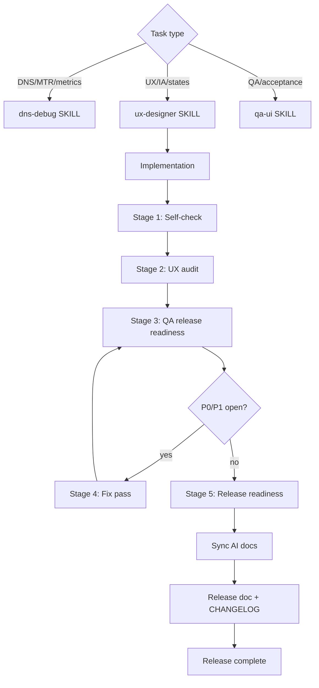

# DNS Debug — Cursor Guide

Cursor-specific mirror of AI role routing, skill paths, and documentation sync requirements. For full engineering context see `AGENT.md`.

## Role routing

Select a role by task type. UI/historical/compare work without QA and UX review is **incomplete**.

| Task | Role | Skill path |
|------|------|------------|
| DNS resolution, metrics, MTR, core API, noise/diagnosis | DNS engineer | `.ai/skills/dns-debug/SKILL.md` |
| Dashboard IA, usability, states, filters, chart hierarchy, microcopy | UX designer | `.ai/skills/ux-designer/SKILL.md` |
| UI acceptance, regression, data correctness, live/historical/compare validation | QA engineer | `.ai/skills/qa-ui/SKILL.md` |

### When to apply each role

| Scenario | Skill |
|----------|-------|
| Test checklist, acceptance, regression, API↔UI correctness, compare deltas | `qa-ui` |
| Dashboard structure, filters, states, hierarchy, chart readability | `ux-designer` |
| DNS logic, metrics, MTR, core API | `dns-debug` |
| Large UI change | UX → implement → Stage 1–5 pre-release workflow (both skills) |
| Compare mode change | Update **both** `qa-ui` and `ux-designer` + `debugging-checklist.md` |
| UI release | Stages 1–3 required; Stage 4 if P0/P1 open; no laptop/tablet P1 blockers |

### Workflow for UI / historical / compare

**Design flow (4 steps):**

1. **UX designer** — IA, states, filter strategy, microcopy (retention, compare deltas)
2. **Implement** — backend + frontend; additive JSON contracts only
3. **QA engineer** — acceptance + regression checklists; API ↔ UI cross-check
4. **Sync docs** — QA skill, UX skill, `AGENT.md`, `debugging-checklist.md`, `CLAUDE.md`, this file, rules

**Pre-release flow (5 stages)** — required for visual/behavioral UI changes:

| Stage | Role | Skill |
|-------|------|-------|
| 1. Self-check | DNS engineer | `dns-debug` |
| 2. UX review | UX designer | `ux-designer` |
| 3. QA review | QA engineer | `qa-ui` |
| 4. Fix pass | DNS engineer | `dns-debug` |
| 5. Release readiness | All | — |

**Release blockers:** P0 data/security; P1 misleading observability; P1 laptop breakage (1024–1440px); P1 tablet breakage (768px); missing state coverage; skipped UX audit or QA pass; stale docs; missing `CHANGELOG.md` or `docs/releases/*`; version mismatch between `app/main.py` and CHANGELOG; partial RU localization or visible translation keys.

**Incomplete task:** UI/UX/historical/compare/i18n changes shipped without updating QA skill, UX skill, relevant AI docs, without completing pre-release Stages 1–3 (and Stage 4 when findings exist), without EN+RU translation keys for new strings, or without release documentation (`CHANGELOG.md` + `docs/releases/X.Y.Z.md`).

Release playbook: [`docs/releases/README.md`](docs/releases/README.md). Operational runbook: `debugging-checklist.md` §10.

## Skill paths

| Skill | Path | Purpose |
|-------|------|---------|
| DNS debug | `.ai/skills/dns-debug/SKILL.md` | DNS/MTR/metrics analysis and change checklist |
| QA UI | `.ai/skills/qa-ui/SKILL.md` | Acceptance, regression, data correctness |
| UX designer | `.ai/skills/ux-designer/SKILL.md` | Dashboard IA, states, compare/historical UX |
| Debugging checklist | `.ai/skills/dns-debug/debugging-checklist.md` | Operational curl workflow + QA acceptance |
| Metrics reference | `.ai/skills/dns-debug/metrics-reference.md` | Prometheus names + UI panel mapping |

## Cursor rules

| Rule | Path | Scope |
|------|------|-------|
| DNS Debug project | `.cursor/rules/dns-debug-project.mdc` | DNS constraints, observability model, UI guidance |
| QA/UX gates | `.cursor/rules/qa-ux-gates.mdc` | Role routing enforcement, doc sync for UI work |

## Mandatory sync table

When changing behavior, update relevant AI docs in the **same change**:

| Change type | Update |
|-------------|--------|
| Metrics added/renamed | `metrics-reference.md` |
| Web UI sections/endpoints | `AGENT.md`, `debugging-checklist.md` |
| Charts, filters, view modes, historical/compare | `qa-ui` + `ux-designer` skills, `debugging-checklist.md`, `AGENT.md` |
| Dashboard IA or state design | `ux-designer` skill, `AGENT.md` UI section |
| Compare mode logic or presentation | `qa-ui` + `ux-designer` skills, `debugging-checklist.md` |
| MTR behavior | `debugging-checklist.md`, `dns-debug` skill |
| New env variable | `AGENT.md`, `dns-debug` skill, `CLAUDE.md`, this file, rules |
| UI i18n / new strings | `app/ui/static/i18n/en.json` + `ru.json`, `AGENT.md` localization section |
| DNS logic / noise types | `dns-debug` skill, `AGENT.md` |
| Operational flow | `debugging-checklist.md` |
| Security / auth | `docs/SECURITY.md`, `AGENT.md`, rules |
| UI/UX/i18n/workflow release | `CHANGELOG.md`, `docs/releases/X.Y.Z.md`, version in `app/main.py`, AI docs |

Do not remove EDNS breakdown, per-resolver analysis, garbage accounting, MTR diagnostics, or UI sections without explicit user request.

## Web UI view modes (summary)

| Mode | Auto-refresh | Data source | Key params |
|------|--------------|-------------|------------|
| **Live** | Toggle ON by default (`DNS_DEBUG_UI_REFRESH_SECONDS`) | In-memory stores | `view_mode=live`; optional `from`/`to` for 15m/1h presets |
| **Historical** | OFF | Event buffer (in-process) or PostgreSQL/file snapshot | `view_mode=historical`, `from`, `to`, `snapshot_id`; **7-day PG retention** when DB enabled |
| **Compare** | OFF | Server-side deltas | `GET /api/ui/compare` with baseline/comparison params incl. `baseline_test_id`, `compare_test_id`, `baseline_resolve_mode`, `compare_resolve_mode` |

Dashboard uses **3-tier IA**: `zone-status` (global_status + KPI trends) → `zone-diagnostics` → `zone-drilldown`. Sticky sub-nav: Status | Diagnostics | Drilldown.

Envelope fields (additive): `view_mode`, `data_source`, `storage_backend`, `time_range`, `retention` (incl. `db_enabled`, `db_retention_days`, `retention_window_from`), `warnings`, `is_stale`, `global_status`, `kpi_extras`.

**Retention invariant:** `DNS_DEBUG_DB_RETENTION_DAYS` default **7** — agents must preserve cleanup behavior and retention-aware UX for history/compare features.

Full UI spec: `AGENT.md` → Web UI section.

## Related files

| File | Purpose |
|------|---------|
| `AGENT.md` | Full engineering brief and AI roles |
| `CLAUDE.md` | Claude Code guide with role selection |
| `README.md` | User-facing quick start and skill links |
