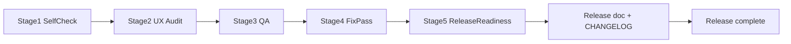

# Release documentation

Internal release packaging for DNS Debug. All UI/UX/i18n/workflow/docs changes must ship as a **release change set**, not as code-only patches.

## Versioning policy

This project follows [Semantic Versioning](https://semver.org/) and [Keep a Changelog](https://keepachangelog.com/en/1.1.0/).

| Bump | When | Examples |
|------|------|----------|
| **Major** | Breaking core API, metric renames, removed endpoints | Rename `dns_debug_*` metrics; change `/tests` contract |
| **Minor** | New optional features, additive API/UI fields, new env vars (backward compatible) | Web UI dashboard; snapshot persistence; new `/api/ui/*` panel |
| **Patch** | Bug fixes, copy tweaks, responsive fixes, doc-only corrections | Chart lifecycle fix; sticky header overlap at laptop widths |

**Version sources of truth:**

| Location | Purpose |
|----------|---------|
| [`app/main.py`](../../app/main.py) | FastAPI `version=` string |
| [`CHANGELOG.md`](../../CHANGELOG.md) | Public changelog entry |
| [`docs/releases/X.Y.Z.md`](.) | Full internal release notes |

All three must match before a release is considered complete.

## Release readiness gate

A task is **incomplete** if any of the following are missing:

- [ ] Version bumped in `app/main.py` (when semver changes)
- [ ] [`CHANGELOG.md`](../../CHANGELOG.md) updated for the release
- [ ] [`docs/releases/X.Y.Z.md`](.) created or updated with full release notes
- [ ] AI docs, rules, and skills synced and listed in the release doc
- [ ] User-visible changes (UX, responsive, i18n) enumerated in release summary
- [ ] Process-visible changes (QA/UX workflow, agent rules) enumerated in release summary
- [ ] Configuration / migration notes documented (if any)

**Pre-release UX workflow (Stages 1–5)** is a QA gate for UI changes. **Stage 5 alone is not sufficient** — release documentation must follow. See [`AGENT.md`](../../AGENT.md) → Pre-release UX workflow and Release documentation.

## Release artifact checklist

When cutting release `X.Y.Z`:

1. **Determine version** — apply semver rationale (document in release notes)
2. **Update `app/main.py`** — `version="X.Y.Z"`
3. **Update `CHANGELOG.md`** — `## [X.Y.Z] - YYYY-MM-DD` with Added/Changed/Fixed sections
4. **Create `docs/releases/X.Y.Z.md`** — full release document (10 sections, see template below)
5. **Sync AI docs** — `AGENT.md`, `CLAUDE.md`, `CURSOR.md`, `.cursor/rules/`, `.ai/skills/`
6. **Update `README.md`** — current release link (if version changed)
7. **Verify** — no version mismatch between `main.py`, CHANGELOG, and release doc

Optional (when explicitly requested): Git tag `vX.Y.Z` and GitHub release at `https://github.com/shatovilya/dns-dig-docker/releases/tag/vX.Y.Z`.

## Release document template

Each `docs/releases/X.Y.Z.md` must include:

1. **Release title / version**
2. **Summary**
3. **UX changes**
4. **Responsive / adaptive fixes**
5. **Localization / Russian language support** (or explicit "none")
6. **QA / UX workflow changes**
7. **Documentation / rules / skills / agent updates**
8. **Breaking changes / compatibility notes**
9. **Configuration notes / env changes**
10. **Known limitations / follow-ups**

## Relationship to pre-release UX workflow

Stages 1–3 are required for all visual/behavioral UI changes. Stage 4 when P0/P1 findings exist. Release documentation is the final gate after Stage 5.

## Release index

| Version | Date | Title | Notes |
|---------|------|-------|-------|
| [0.5.0](0.5.0.md) | 2026-07-10 | Web UI localization (EN/RU) | i18n switcher, Intl formatting, signal params |
| [0.4.0](0.4.0.md) | 2026-07-10 | PostgreSQL Historical Persistence | 7-day retention, local Postgres, cleanup metrics |
| [0.3.0](0.3.0.md) | 2026-07-10 | Web UI Observability Layer | Optional dashboard, live/historical/compare, snapshots |
